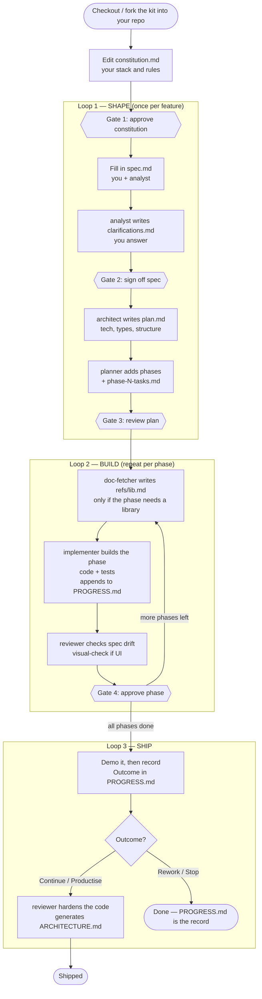

# How It Works — A Plain-English Walkthrough

New to this workflow? Start here. This explains the files, the flow, what changes when, and shows the whole thing as one diagram. Once it clicks, [`quickstart.md`](quickstart.md) gives you the exact commands, and [`full-proposal.md`](full-proposal.md) explains *why* it's built this way.

---

## The one-line mental model

> **You decide *what* and *why*; the AI agents do the typing.** Nothing gets built until there's a written spec and plan. Work happens in small phases that each fit one AI session, and a `PROGRESS.md` file carries the memory between sessions.

That's the whole philosophy. Everything below is just the mechanics.

---

## Two kinds of files

There are **kit files** (the reusable scaffolding this repo gives you) and **artifact files** (what you produce for each feature you build). Don't let the count scare you — most are templates you copy, and you only ever focus on one or two at a time.

### Kit files (come with the repo, mostly read-only)

| File | What it's for | You touch it? |
|---|---|---|
| `README.md` | The reference: the loop, the agents, the stages | Read once |
| `docs/how-it-works.md` | This file — the plain-English orientation | Read once |
| `docs/quickstart.md` | The step-by-step you'll actually follow | Your manual |
| `docs/full-proposal.md` | The *why* behind every design choice | Read once, optional |
| `constitution.md` | The project's non-negotiable rules (stack, testing, "don't over-engineer") | Edit once per project |
| `AGENTS.md` | The contract every agent reads before working | Rarely |
| `CLAUDE.md` | Just points to `AGENTS.md` (so other tools find the rules too) | Never |
| `.claude/agents/*.md` | The agent definitions (their job descriptions) | Never, unless tuning |
| `specs/_template/` | Blank `spec.md`, `plan.md`, `phase-template.md` to copy | Copy per feature |
| `templates/PROGRESS.md` | Blank "living memory" file to copy to your repo root | Copy once |
| `templates/ARCHITECTURE.md` | Blank "final map," generated only if you keep the prototype | Auto-filled at end |

### Artifact files (you and the agents create these per feature)

| File | Created by | Purpose | Gets updated? |
|---|---|---|---|
| `specs/<feature>/spec.md` | You (analyst helps) | **What & why** — user story, acceptance criteria, out-of-scope | During Clarify |
| `specs/<feature>/clarifications.md` | analyst | Open questions + your answers (skipped on the lean path) | Until answered |
| `specs/<feature>/plan.md` | architect + planner | **How** — tech, types, structure, then the phase breakdown | During planning |
| `specs/<feature>/phases/phase-N-tasks.md` | planner | The to-do list for **one phase** | Once per phase |
| `specs/<feature>/refs/<lib>.md` | doc-fetcher | Cached API docs for a library (optional) | As needed |
| `PROGRESS.md` (repo root) | implementer | **The living memory** — what's built, decisions, what's deferred | **Every phase** ⭐ |
| `ARCHITECTURE.md` (repo root) | reviewer | The final system map | Once, only if you continue |

⭐ `PROGRESS.md` is the single most important file. It's how each fresh AI session "remembers" what the previous ones did.

---

## The agents (each does one job)

| Agent | Job | Produces |
|---|---|---|
| **analyst** | Validates your spec, asks clarifying questions | `spec.md`, `clarifications.md` |
| **architect** | Decides tech stack, types, structure | `plan.md` (architecture part) |
| **planner** | Slices the work into phases | phases + `phase-N-tasks.md` |
| **doc-fetcher** | Pulls library docs so the builder doesn't waste time | `refs/<lib>.md` |
| **implementer** | Builds **one phase** with tests | code, tests, `PROGRESS.md` |
| **reviewer** | Checks each phase for drift; cleans up at the end | review notes, `ARCHITECTURE.md` |
| **visual-check** (optional) | For UI: compares against the brand | a visual report |

---

## End-to-end flow (what you actually do)

The work is organized into **3 loops** and **4 human gates** — points where the workflow stops and waits for your approval.

**Setup (once per project)**

1. **Fork/copy this kit into your prototype's repo** — copy `.claude/`, `AGENTS.md`, `CLAUDE.md`, `constitution.md`, `templates/`, `specs/`, and copy `templates/PROGRESS.md` → `PROGRESS.md` at the root.
2. **Edit `constitution.md`** to match your stack (Python? React? Kedro?). → 🚦 **Gate 1: approve the constitution.**

**Loop 1 — SHAPE (once per feature)**

3. **Copy `specs/_template/` → `specs/my-feature/`** and fill in `spec.md` (the user story).
4. Run **analyst** → it restates your intent and writes `clarifications.md`. You answer the questions. → 🚦 **Gate 2: sign off the spec.**
5. Run **architect** → writes the tech/architecture half of `plan.md`.
6. Run **planner** → adds the phase breakdown to `plan.md` and creates one `phase-N-tasks.md` per phase. → 🚦 **Gate 3: review the plan** (expect 2–4 rounds — this is the real work).

**Loop 2 — BUILD (repeat for each phase)**

7. (If a phase needs a library) run **doc-fetcher** → saves `refs/<lib>.md`.
8. Run **implementer** for that one phase → writes code + tests, then **appends a phase entry to `PROGRESS.md`**.
9. Run **reviewer** (and **visual-check** for UI) → checks the phase matches the spec. → 🚦 **Gate 4: approve the phase**, then move to the next one.

**Loop 3 — SHIP (once, at the end)**

10. **Demo it**, then record the **Outcome** in `PROGRESS.md`: *Continue / Rework / Stop / Productise*.
11. **Only if Continue or Productise:** run **reviewer** in harden mode → removes duplication/dead code, simplifies, and generates `ARCHITECTURE.md`. If Stop/Rework, you're done — no point polishing something you're shelving.

> **Lean path for tiny features:** skip Clarify and use a single phase. The minimum is still `spec.md → plan.md → phase-1-tasks.md → implement → PROGRESS.md`.

---

## Which files change, and when

```
SETUP      constitution.md   ← edit once
           PROGRESS.md       ← created at root (empty)

SHAPE      spec.md           ← you write, analyst refines
           clarifications.md ← analyst writes, you answer
           plan.md           ← architect, then planner

BUILD      refs/<lib>.md     ← doc-fetcher (optional)
(×N)       <code & tests>    ← implementer
           PROGRESS.md       ← APPENDED every phase  ⭐

SHIP       PROGRESS.md       ← Outcome decision recorded
           ARCHITECTURE.md   ← generated only if you continue
```

---

## The flow as a diagram



---

## The five things to remember

1. **Spec before code, always.** No building until `spec.md` and `plan.md` are approved.
2. **One phase at a time**, each in a fresh AI session — that keeps the AI sharp.
3. **`PROGRESS.md` is the memory.** Every phase updates it; every session reads it first.
4. **Four gates are yours.** The AI stops and waits for your approval at constitution, spec, plan, and each phase.
5. **Decide before you polish.** Demo → record the Outcome → only harden if you're keeping it.
